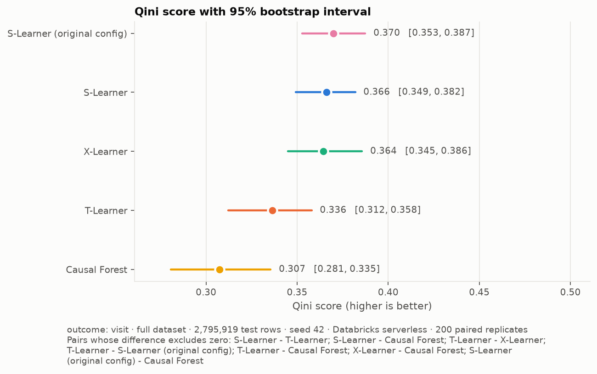
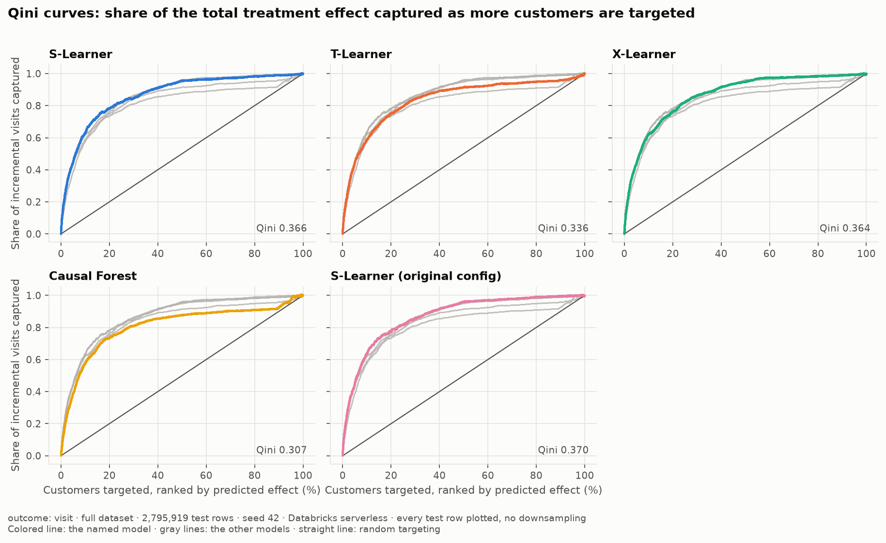
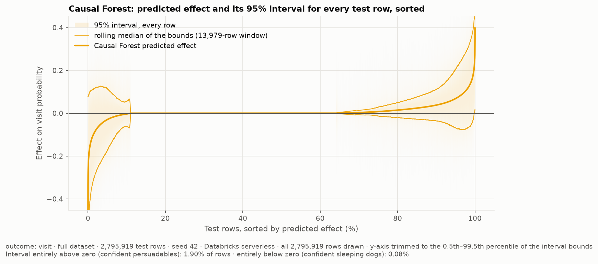
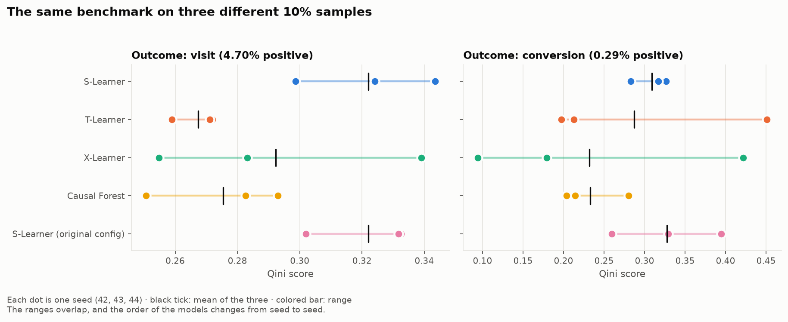
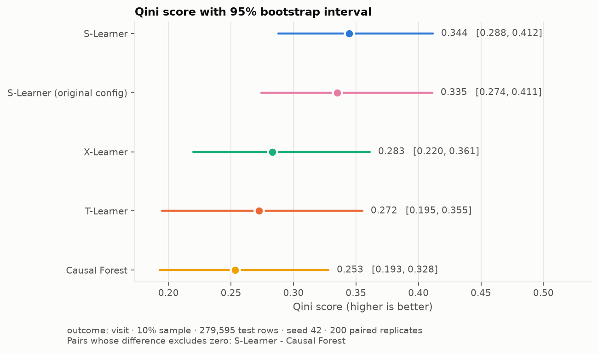
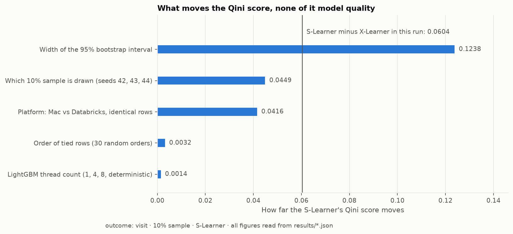
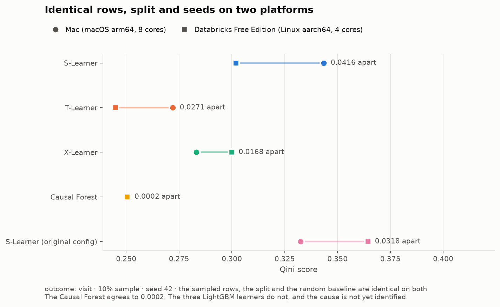

# UpliftBench

**A reproducible benchmark of four heterogeneous-treatment-effect estimators on 13.98 million Criteo customer records, with bootstrap intervals, repeated train/test splits, and a Databricks pipeline.**

Uplift modeling asks which customers a marketing treatment actually moves. This repository benchmarks the S-Learner, T-Learner and X-Learner (LightGBM base learners) and EconML's Causal Forest on the Criteo Uplift v2.1 dataset, scores them with the Qini coefficient, and, unlike the original version of this work, reports how much of the difference between models is noise. The answer is most of it: on the full dataset the three best estimators cannot be told apart at 95%.

## Headline results

<!-- generated:headline -->
| Model | Mean Qini over 3 splits | Range across splits | Top 20% capture (mean) | Top 50% capture (mean) |
|---|---|---|---|---|
| S-Learner (original config) | 0.3677 | 0.3660 to 0.3696 | 77.6% | 94.9% |
| S-Learner | 0.3665 | 0.3645 to 0.3686 | 78.1% | 94.6% |
| X-Learner | 0.3617 | 0.3548 to 0.3659 | 76.0% | 94.3% |
| T-Learner | 0.3469 | 0.3363 to 0.3558 | 75.6% | 92.5% |
| Causal Forest | 0.2941 | 0.2811 to 0.3049 | not applicable | not applicable |

Full dataset, 11,183,673 training rows and 2,795,919 test rows per split, three train/test splits, Causal Forest on 25% of the training rows. Every figure is read from `results/`.
<!-- /generated:headline -->

Three findings from the full dataset:

1. **The top three estimators are statistically tied.** The S-Learner, the X-Learner and the S-Learner with its original settings are not separable at 95% on any of the three splits. The S-Learner is the most stable across splits, so it remains a reasonable production choice, but the benchmark does not support calling it the winner.
2. **A single train/test split cannot rank the estimators.** The T-Learner separates from the top three on one split and not on another; the split alone moves its Qini by 0.02, as much as the gap that separated it.
3. **The Causal Forest improves with data and still trails.** Fitting it on 25% of the training rows rather than 10% raises its Qini from 0.259 to 0.305 with non-overlapping intervals. It remains below every meta-learner on every split.

Targeting the top 20% of customers ranked by the S-Learner captures about 78% of the incremental visits in the test set, against 20% for random targeting.

## What is measured

| Property | Value |
|---|---|
| Dataset | Criteo Uplift v2.1, 13,979,592 rows, 12 anonymized covariates |
| Treatment | Binary, 85% treated and 15% control; propensity AUC 0.509, so assignment is close to random |
| Outcome | `visit` (4.7% positive). Every full-data result models visits. `conversion` (0.29% positive) is run on 10% samples only |
| Split | 80/20 train/test, repeated with three split seeds on the full dataset |
| Metric | Qini coefficient as defined by `causalml.metrics.qini_score`, plus the share of incremental visits captured in the top 20% and 50% of the ranking |
| Uncertainty | 200 paired bootstrap replicates over test rows per run, giving an interval for each model and for each difference between two models |

The four estimators share one LightGBM configuration so the comparison is like for like. The S-Learner's original settings (`min_child_samples=5`, no regularization) are kept as a labelled fifth model because the first version of this benchmark used them for the S-Learner alone. The X-Learner receives the fitted propensity scores rather than fitting its own, which removes the convergence warnings the earlier version produced.

## Results in detail

### Full dataset, three train/test splits

<!-- generated:splits -->
| Model | Split 42 | Split 43 | Split 44 | Mean | Spread |
|---|---|---|---|---|---|
| S-Learner (original config) | 0.3696 [0.353, 0.387] | 0.3660 [0.353, 0.382] | 0.3675 [0.353, 0.382] | 0.3677 | 0.0036 |
| S-Learner | 0.3663 [0.349, 0.382] | 0.3645 [0.349, 0.381] | 0.3686 [0.353, 0.385] | 0.3665 | 0.0041 |
| X-Learner | 0.3643 [0.345, 0.386] | 0.3548 [0.336, 0.375] | 0.3659 [0.345, 0.385] | 0.3617 | 0.0111 |
| T-Learner | 0.3363 [0.312, 0.358] | 0.3558 [0.334, 0.384] | 0.3486 [0.323, 0.380] | 0.3469 | 0.0194 |
| Causal Forest | 0.3049 [0.281, 0.335] | 0.2811 [0.254, 0.307] | 0.2964 [0.274, 0.326] | 0.2941 | 0.0237 |

Rank order by Qini:  
split 42: S-Learner (original config) > S-Learner > X-Learner > T-Learner > Causal Forest  
split 43: S-Learner (original config) > S-Learner > T-Learner > X-Learner > Causal Forest  
split 44: S-Learner > S-Learner (original config) > X-Learner > T-Learner > Causal Forest

Full dataset, 2,795,919 test rows per split, Causal Forest on 25% of training rows, 200 paired bootstrap replicates per split, 102 minutes of serverless compute in total.
<!-- /generated:splits -->





### Scaling the Causal Forest

The forest was fitted on increasing shares of the training rows on Databricks Free Edition serverless compute (4 cores, 16.4 GB).

<!-- generated:forest -->
| Share of training rows | Rows | Causal Forest Qini | 95% interval | Confident persuadables | Peak memory, time |
|---|---|---|---|---|---|
| 10% | 1,118,367 | 0.2586 | 0.2360 to 0.2854 | 1.84% | 6.17 GB, 22 min |
| 25% | 2,795,918 | 0.3049 | 0.2807 to 0.3355 | 1.90% | 6.39 GB, 35 min |
| 50% | 5,591,836 | out of memory | not reached | not reached | 6.44 GB at the checkpoint, then killed |
| 100% | 11,183,673 | out of memory | not reached | not reached | 6.64 GB at the checkpoint, then killed |
<!-- /generated:forest -->

The meta-learners are identical across these runs; only the forest changes. Free Edition fits the forest on a quarter of the training rows and not on half.



For about half of the test rows the forest predicts an effect below 0.001 in absolute value with an interval narrower than 0.001, while the 90th percentile interval width is 0.34. The models also disagree far more about which customers are harmed than their Qini scores suggest: the share of test rows with a negative predicted effect is 1.8% for the S-Learner, 11.2% for the Causal Forest, 16.0% for the X-Learner and 37.2% for the T-Learner (10% sample, seed 42).

### Seed variance on 10% samples

The same benchmark on three different 10% samples of the data, for both outcomes. Levels are not comparable to the full-data results above; the point is how far the scores move between samples.

<!-- generated:seeds-visit -->
| Model | Seed 42 | Seed 43 | Seed 44 | Mean | Spread |
|---|---|---|---|---|---|
| S-Learner (original config) | 0.3326 | 0.3020 | 0.3317 | 0.3221 | 0.0306 |
| S-Learner | 0.3435 | 0.2986 | 0.3240 | 0.3220 | 0.0449 |
| X-Learner | 0.2831 | 0.2548 | 0.3390 | 0.2923 | 0.0843 |
| Causal Forest | 0.2506 | 0.2930 | 0.2826 | 0.2754 | 0.0424 |
| T-Learner | 0.2720 | 0.2589 | 0.2710 | 0.2673 | 0.0131 |
| Random | 0.0667 | -0.0109 | 0.0361 | 0.0306 | 0.0776 |

Rank order by Qini:  
seed 42: S-Learner > X-Learner > T-Learner > Causal Forest  
seed 43: S-Learner > Causal Forest > T-Learner > X-Learner  
seed 44: X-Learner > S-Learner > Causal Forest > T-Learner

Rows per run: 1,397,972 sampled, 1,118,377 train, 279,595 test. Convergence warnings across runs: 0. Causal Forest confident persuadables by seed: 2.13%, 1.99%, 1.96%.
<!-- /generated:seeds-visit -->

<!-- generated:seeds-conversion -->
| Model | Seed 42 | Seed 43 | Seed 44 | Mean | Spread |
|---|---|---|---|---|---|
| S-Learner (original config) | 0.3293 | 0.3944 | 0.2595 | 0.3277 | 0.1348 |
| S-Learner | 0.2829 | 0.3265 | 0.3170 | 0.3088 | 0.0435 |
| T-Learner | 0.1975 | 0.4510 | 0.2127 | 0.2871 | 0.2535 |
| Causal Forest | 0.2800 | 0.2144 | 0.2039 | 0.2328 | 0.0762 |
| X-Learner | 0.1793 | 0.4215 | 0.0941 | 0.2316 | 0.3274 |
| Random | -0.0365 | 0.1827 | 0.0019 | 0.0494 | 0.2192 |

Rank order by Qini:  
seed 42: S-Learner > Causal Forest > T-Learner > X-Learner  
seed 43: T-Learner > X-Learner > S-Learner > Causal Forest  
seed 44: S-Learner > T-Learner > Causal Forest > X-Learner

Rows per run: 1,397,972 sampled, 1,118,377 train, 279,595 test. Convergence warnings across runs: 0. Causal Forest confident persuadables by seed: 0.28%, 0.28%, 0.26%.
<!-- /generated:seeds-conversion -->



### Bootstrap intervals on one 10% sample

<!-- generated:intervals-10pct -->
| Model | Qini | 95% interval | Ranked first in replicates |
|---|---|---|---|
| S-Learner | 0.3444 | 0.2878 to 0.4116 | 60% |
| S-Learner (original config) | 0.3351 | 0.2743 to 0.4112 | 34% |
| X-Learner | 0.2831 | 0.2197 to 0.3612 | 4% |
| T-Learner | 0.2722 | 0.1947 to 0.3552 | 2% |
| Causal Forest | 0.2533 | 0.1929 to 0.3281 | 1% |

Outcome `visit`, 279,595 test rows, seed 42, 200 paired bootstrap replicates. Differences whose interval excludes zero: S-Learner - Causal Forest (+0.0911, +0.0132 to +0.1802).
<!-- /generated:intervals-10pct -->



### What moves a Qini score

Two effects unrelated to model quality were measured on the seed 42 sample (`results/sensitivity_visit_frac0.1_seed42.json`):

- **Tie order.** Tree models give many rows the same score (89% of the S-Learner's test rows share a score with another row), and `causalml` sorts with an unstable sort, so its Qini depends on an arbitrary ordering of tied rows. Thirty random tie orders moved the S-Learner's Qini between 0.3414 and 0.3446.
- **LightGBM thread count.** Fitting with 1, 4 or 8 threads, or in deterministic mode, moved it by 0.0014.

The same code on the same rows also gives different LightGBM scores on Databricks (Linux, aarch64) than on a Mac (macOS, arm64): 0.302 against 0.343 for the S-Learner, while the Causal Forest agrees to 0.0002. Neither platform is noisy on its own; both reproduce their own results to tie-order precision. The cause has not been identified.





## Reproducing the results

### Locally

```bash
pip install -r requirements.txt
python run_benchmark.py --sample-frac 0.1 --seed 42 --outcome visit --n-boot 200   # downloads the data on first use
python summarize_results.py --write-readme                                          # regenerates every table above
python analysis/make_plots.py                                                       # regenerates every figure
pytest tests/
```

A 10% run takes about four minutes on an 8-core laptop and needs under 2 GB of memory. `--sample-frac 0` runs the full dataset; `--split-seed` changes the train/test split; `--cf-frac` sets the share of training rows given to the Causal Forest.

Every run writes two files: `results/benchmark_<outcome>_<size>_seed<seed>.json` with every figure it produced, and `results/predictions/predictions_*.parquet` with the complete per-row output (each test row's outcome, treatment flag, every model's predicted effect and the Causal Forest interval). All curves and figures are drawn from the per-row files at full resolution. The per-row files for the full dataset are about 110 MB each and are kept out of the repository; they live in the Databricks volume and under `data/predictions/` locally.

### On Databricks

The full-data runs were made on Databricks Free Edition serverless compute.

```bash
python databricks/submit.py --sample-frac 0 --seed 42 --split-seed 42 --outcome visit --cf-frac 0.25 --n-boot 200
```

`databricks/01_ingest_to_delta.py` reads the compressed CSV from a Unity Catalog volume with PySpark, writes the Delta table `workspace.upliftbench.criteo_uplift`, and asserts the row count, the row-id range and the per-arm outcome rates against the local loader. `databricks/02_benchmark_mlflow.py` runs the same `run_benchmark.run` against the volume copy of the data and logs every parameter, metric and result file to MLflow. `databricks/submit.py` uploads the current code, submits the job with serverless environment version 4 (Python 3.12), waits, and saves the result under `results/`.

Two details matter on Free Edition. `causalml` and `econml` publish no wheels for the platform's aarch64 architecture and their source builds fail there, so `.github/workflows/build-arm-wheels.yml` builds both wheels on a free GitHub ARM runner inside a `manylinux_2_28` container; the job installs them from the volume. And a notebook task runs on the default Python 3.11 environment, where those wheels cannot install, so the benchmark is submitted as a Python script task with an explicit environment.

`results/databricks_environment_probes.json` records what the environment provides (4 cores, 16.4 GB, library versions, network reachability) and the exact build errors. `results/databricks_job_runs.json` logs every job run, including the failures.

## Project layout

```
run_benchmark.py            One run: load, split, fit the five models, score, bootstrap, write results and predictions
summarize_results.py        Builds every README table from results/*.json (--write-readme rewrites them in place)
src/
  preprocessing.py          Download, DuckDB loader with a deterministic hash sample, split, propensity, features
  learners.py               S-, T-, X-Learner and Causal Forest wrappers with one shared base-learner configuration
  evaluation.py             Qini scoring, policy simulation, outcome-aware labels
  intervals.py              Fast Qini, complete Qini curves, paired bootstrap intervals
  visualization.py          The original notebook's plots
analysis/
  make_plots.py             Every figure in results/plots, drawn from the result and per-row files
  sensitivity.py            Tie-order and thread-count experiments
  capture_databricks_probes.py
databricks/
  01_ingest_to_delta.py     PySpark ingest of the CSV to a Delta table, with assertions
  02_benchmark_mlflow.py    The benchmark as a serverless job with MLflow tracking
  submit.py                 Uploads the code, submits the job, saves the result
results/                    Every result file, the per-row predictions for the 10% runs, and 53 figures
tests/                      Seeding, outcome selection, the X-Learner fit, Qini equality with causalml, the bootstrap
modeling.ipynb              The original exploratory notebook, kept as run
```

## Methods

- **S-Learner** fits one model with the treatment indicator as a feature and predicts the difference between the treated and untreated prediction for each row.
- **T-Learner** fits separate outcome models for the treated and control groups and takes the difference.
- **X-Learner** imputes each group's treatment effects with the other group's model and combines the two estimates with the propensity score.
- **Causal Forest** (EconML `CausalForest`, 100 trees) estimates the effect and a 95% interval for each row.
- **Qini** follows `causalml.metrics.qini_score` with `normalize=True`. `src/intervals.py` reimplements it in NumPy, tested equal to within 1e-10, so that a paired bootstrap of 200 replicates over 2.8 million rows runs in minutes.

## Limitations

- Only `visit` is modelled at full scale. `conversion` (0.29% positive) is far noisier at 10% scale and would need the full dataset and several splits before any model could be ranked on it.
- The features are anonymized, so the SHAP analysis in the notebook identifies covariate indices rather than business meaning.
- The cross-platform difference in LightGBM scores is unexplained.
- The Causal Forest was fitted on at most 25% of the training rows because of the memory available on Free Edition.
- The published abstract for the first version of this work reported a single unseeded run and described the outcome as conversions. The tables above supersede those figures.

## Data

Criteo Uplift v2.1 is downloaded on first use from the `criteo/criteo-uplift` dataset on Hugging Face (311 MB compressed). It is not stored in this repository.
